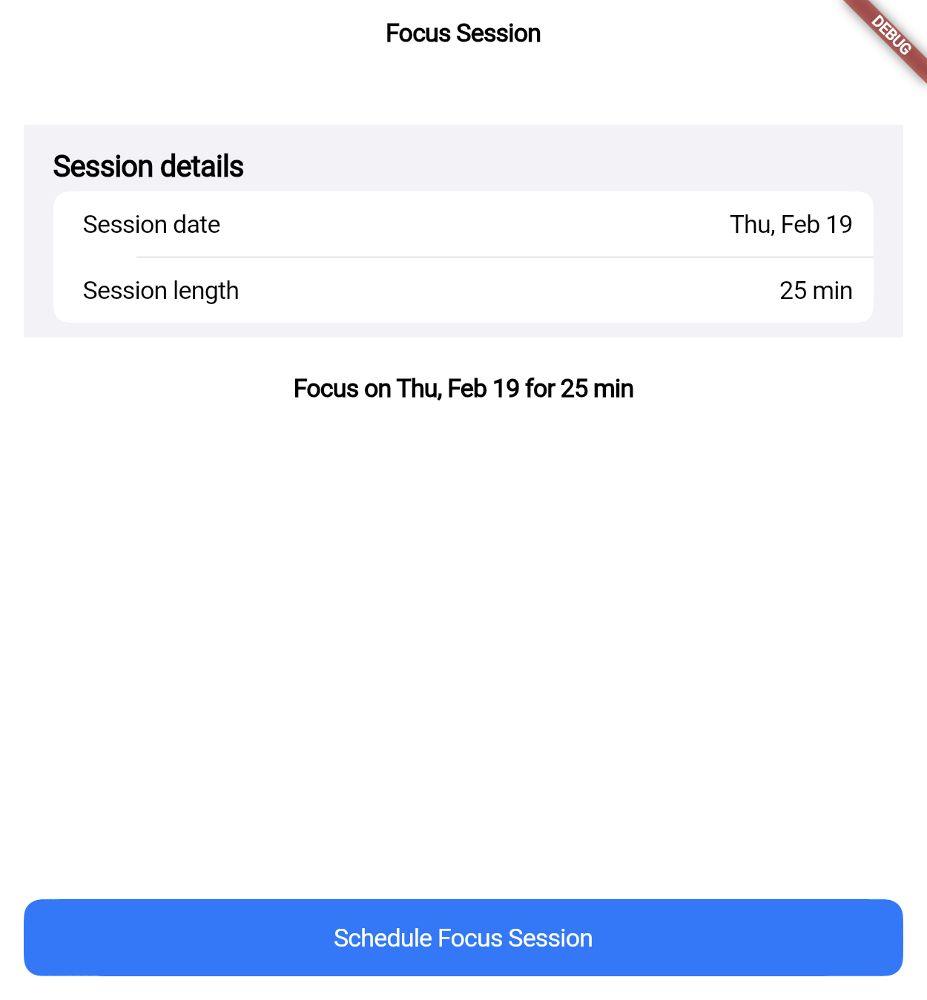

# cupertino_pickers

A tiny Flutter demo showing how to schedule a focus session using Cupertino date and timer pickers.

## Run instructions

Requires Flutter 3.27+ and Dart 3.10+.

```bash
cd cupertino_pickers
flutter pub get
flutter run
```

Tested on iOS simulator and Android emulator.

## Widget attributes (demo highlights)

This demo showcases three key properties of the Cupertino pickers:

- **`CupertinoDatePicker.mode`** — Default is `CupertinoDatePickerMode.dateAndTime`. We use `CupertinoDatePickerMode.date` so the picker shows only month/day/year. Changing to `.dateAndTime` adds a time column; use `.date` when you only need a session day (e.g. booking, reminders).

- **`CupertinoDatePicker.initialDateTime`** — Default is the current date and time. We set it to the selected date so the picker opens at the last chosen value. A developer might use `DateTime.now().add(Duration(days: 1))` to default to tomorrow for appointment apps.

- **`CupertinoTimerPicker.minuteInterval`** — Default is `1` (every minute selectable). We use `5` so minutes jump 0, 5, 10, 15, etc., which fits focus-session presets (25, 30, 45 min). Use higher values to constrain granularity in timers or schedules.

## Screenshot


